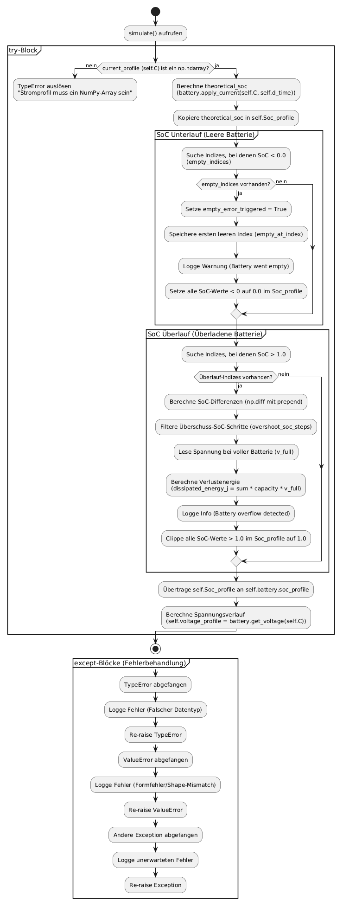

# Programmieren_Abschlussprojekt_SS_2026
Abschlussprojekt von Fabian Kehl und Ben Hofer

## Umgesetzte mögliche Erweiterungen 
* **Alle Git-Commits folgenden den "Conventional Commits"**
* **Berechnung der Luftdichte aus Höhe und Temperatur** 
* **Diverse Plots: Höhenprofil, Stromfluss, Klemmenspannung**
* **Plotten der Strecke auf einer Karte mit interaktivem Slider für GPS Daten am ausgewählten Punkt**
* **Die Simulation arbeitet mit einem Bremswiderstand der Überschüssige Energie Dissipiert** 

## Anforderungen 
* **Python** (Dieses Projekt wurde auf Python 3.14 entwickelt und diese Version wird von uns Empfohlen)

## Installation
1. **Repo Klonen und aufrufen**  
    git clone [https://github.com/Ben-hfr/Programmieren_Abschlussprojekt_SS_2026.git]  
    cd Programmieren_Abschlussprojekt_SS_2026

2. **Virtuelle Umgebung Erstellen und Aktivieren**
    - Windows  
        python -m venv .venv  
        .venv\Scripts\activate  
    - MacOS / Unix  
        python3 -m venv .venv  
        source .venv/bin/activate  

3. **Abhänigkeiten und Packages Installieren**   
    pip install --upgrade pip  
    pip install -r docs/requirements.txt  

## Ausführung und Anwendung
1. main.py Datei abrufen und ausführen (der mainloop des GUI von TK Inter startet)
2. Oben links auf das gelbe Feld klicken und CSV Datei aus dem Ordner "data" aufrufen 
3. In der linken Spalte auf berechnen Drücken (Paramter sind Grundeinstellungen diese können bei bedarf verändert werden)
4. Simualtion ausführen
5. Oben mittig kann zwischen den verschiedenen Taps gewechselt werden um sich verschiedene Plots anzuschauen 
6. Unten links gibt es ein kleines Fenster mit Ergebnissen aus der Berechnung der CSV Datei

## GIF zur Ausführung 

## Aktivitätsdiagramm der Batterie Simulation 

## Ordnerstrukur 
Programmieren_Abschlussprojekt_SS_2026/  
├──README.md  
├──.gitignore  
├──.gitattributes  
├──gui_app.py  
├──main.py  
├──data/  
│&emsp;├──csv_to_array.py  
│&emsp;└──final_project_input_data.csv  
│  
├──docs/  
│&emsp;└──requirements.txt  
│  
└──src/  
&emsp;├──gps_auswertung/  
&emsp;│&emsp;├──calc_force_data.py  
&emsp;│&emsp;├──calc_gps_data.py  
&emsp;│&emsp;└──calc_motor_data.py  
&emsp;└──simulation/  
&emsp;&emsp;├──battery_base.py  
&emsp;&emsp;├──LiPo_battery.py  
&emsp;&emsp;├──NMC_battery.py  
&emsp;&emsp;└──simulator.py  

## Beteiligte Personen 
- Ben Hofer 
    - GitHub @Ben-hfr
- Fabian Kehl
    - GitHub @Fabian580
